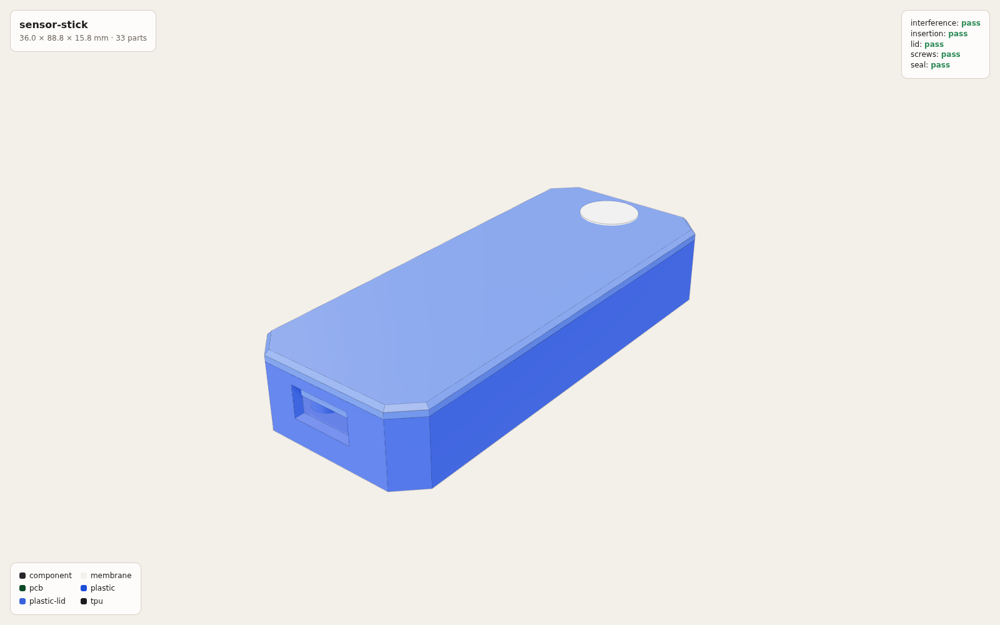
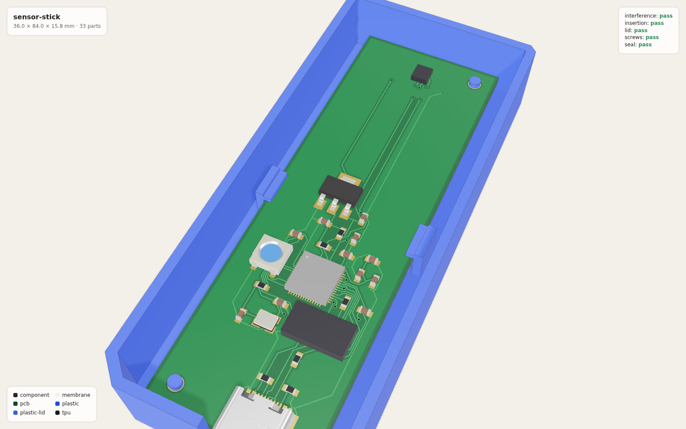
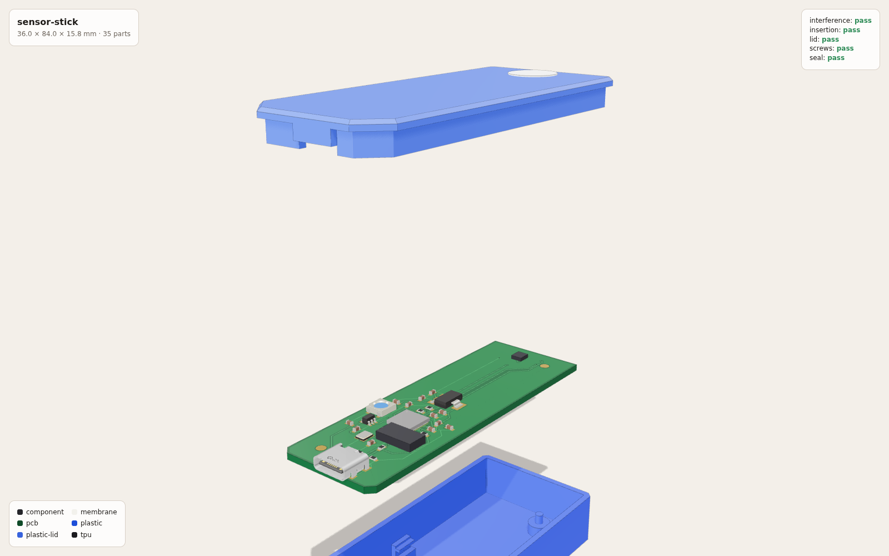

# sensor-stick

A USB-C stick that reports room temperature and humidity to a web page — a
whole product, from one declaration, built with
[Fiducial](https://github.com/AleksaZCodes/fiducial) and checked in its CI.

It is the platform's worked example: small and cheap (an RP2040, an AHT20
sensor, a WS2812B LED behind a 5 V buffer, a USB-C socket: 23 parts, $4.74
of them per board at five boards, LCSC's prices with minimum orders, checked
against a $15 ceiling on every derive; the printed case and the vent are not
priced), but it carries every discipline a product has — a printed case, a
routed board, firmware and a web page — and every one of them is derived
from, or checked against, the same facts.

**Status: designed and checked, not built.** Every part is a real,
orderable part, the board routes and passes KiCad's DRC, the firmware
compiles and the page type-checks. Nobody has ordered it, soldered it or
plugged it in. What would be learnt on the bench is not claimed here.

| | | |
|---|---|---|
|  |  |  |
| assembled: 36 × 84 × 15.5 mm, the USB-C socket flush with the case at one end, the sensor's vent at the other | the routed board in the base: the sensor alone at the far end, under its chimney | lid, board, base |

Renders from `hardware/build.sh`, copied to `hardware/showcase/`.

## What a person writes

| File | Is |
|---|---|
| [`hardware/product.toml`](hardware/product.toml) | the product: its outline, its case, every part (an LCSC number, a KiCad symbol and footprint) and what each pin connects to |
| [`hardware/outline.svg`](hardware/outline.svg) | the stick's shape, seen from above |
| [`hardware/vendor/`](hardware/vendor) | parts KiCad has no entry or no 3D model for, from LCSC's library (`parts.py fetch`), and the USB-C socket: KiCad's land pattern with LCSC's model on it, with where each came from |
| [`firmware/rp2040/src/main.rs`](firmware/rp2040/src/main.rs), [`firmware/shared/src/lib.rs`](firmware/shared/src/lib.rs) | the firmware: read the sensor once a second, send the reading as a fiducial-protocol frame over USB serial, colour the LED |
| [`web/src/`](web/src) | the page: connect over Web Serial, show the reading |
| [`protocol.toml`](protocol.toml) | the reading's payload — its kind byte and fields — declared once for both sides of the USB link |

## What is derived from it

`fid derive` (gated by `fid derive --check`):

| File | Is |
|---|---|
| `hardware/generated/layout.json` | every position and size, and `why` — what set each |
| `hardware/generated/placement.json` | the board placement, solved by a constraint solver (CP-SAT) |
| `hardware/generated/board.kicad_pcb`, `board.kicad_sch` | the board with every footprint placed and every pad on its net; the schematic |
| `hardware/generated/bom.csv`, `assembly.md` | the bill of materials; the order it goes together in |
| `hardware/generated/interface.ts` | the nets as a TypeScript type — the page imports it |
| `hardware/generated/board.rs` | the firmware's pin map: `board::sensor_sda!(p)` is `p.PIN_4` — the firmware takes every pin through it, and a pin named directly fails derive |
| `protocol/messages.rs`, `protocol/messages.ts` | the reading's encoder for the firmware and decoder for the page, from the same table — they cannot disagree |
| `hardware/generated/assembly.md` → why | the USB-C CC voltage each kind of source reads, solved from the pull-downs and checked against the Type-C spec's window — a wrong resistor fails derive |

`hardware/build.sh` (built, checked, not committed): the routed and
DRC-checked board, the case as STEP and STL, the fit and assembly checks,
and `hardware/build/fab/` — Gerbers, the assembly BOM and the placement file
a board house takes.

`python3 hardware/parts.py resolve` checked every LCSC number against LCSC's
own record of it and wrote what it found to `hardware/parts.lock`.

## Change one thing

Move the sensor's data line from `GPIO4` to `GPIO6` in `product.toml`:

1. `fid derive --check` fails: the board, the schematic, the interface and
   `board.rs` no longer match the declaration.
2. `fid derive` moves the copper, relabels the schematic and rewrites
   `board.rs`.
3. The firmware does not compile — and should not: GPIO6 is not one of
   I2C0's SDA pins, and Embassy's types say so. Move it to `GPIO8` instead
   (I2C0 SDA) and the firmware compiles with no edit to it.

Rename the net `SENSOR_SDA` and every line of firmware or page code that
still uses the old name stops compiling. Nothing is copied by hand, so
nothing can be left behind.

## Build it

```sh
fid derive                                   # the gated artifacts
python3 hardware/parts.py sync               # vendor symbols, footprints, models
hardware/build.sh                            # route, solids, checks, fab files, renders
(cd firmware/rp2040 && cargo build --release) # the firmware (thumbv6m-none-eabi)
(cd firmware && cargo test -p firmware-shared --target x86_64-unknown-linux-gnu)
node --experimental-strip-types --test web/src/reading.test.ts
npx esbuild web/src/main.ts --bundle --format=esm --outfile=web/dist/main.js --tsconfig=web/tsconfig.json
```

Then serve `web/` and open `index.html` in Chrome or Edge.

The first flash needs no programmer: an RP2040 with empty flash starts its
USB bootloader, and `elf2uf2-rs` or `picotool` copies the firmware across.

## How it was made

With the commands above and an agent: the walk-through, step by step — what
was typed, what the agent changed, what the gates refused and why — is
[`docs/guides/sensor-stick.md`](../../docs/guides/sensor-stick.md).
